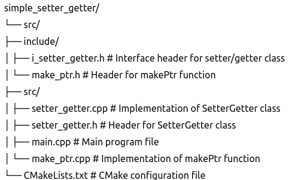

# SimpleSetterGetter

A simple C++ project demonstrating the usage of setter and getter functions with an interface and CMake for project management.

## Project Structure



## Features

- **Interface Design**: Demonstrates the use of a C++ interface (`ISetterGetter`) with pure virtual functions.
- **Implementation Class**: Provides a concrete implementation (`SetterGetter`) of the interface.
- **Factory Function**: Uses a factory function (`makePtr`) to create instances of the implementation class.
- **CMake Build System**: Configures the project with CMake for easy compilation and management.

## Requirements

- **C++17**: The project requires a C++17 compatible compiler.
- **CMake**: Version 3.10 or higher is recommended.

## Building the Project

Follow these steps to build the project:

1. **Clone the repository**:
   ```sh
   git clone git@github.com:Anojyadav/simple_setter_getter.git
   cd simple_setter_getter
   cmake -H. -B build
   cd build
   make -j
   ./SimpleSetterGetter
